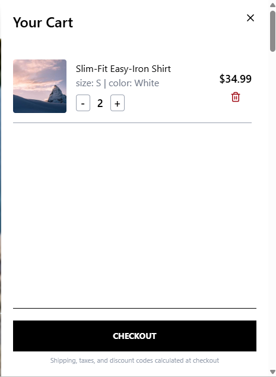
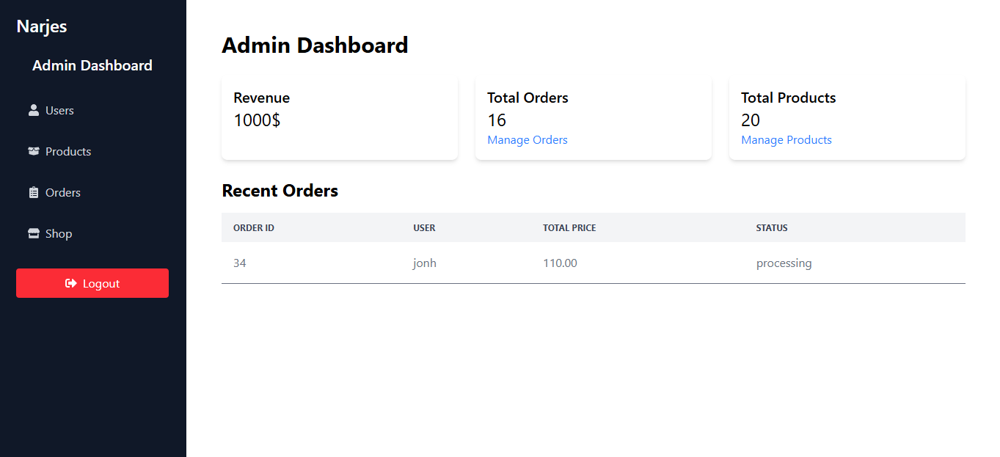

# 🛒 Narjes – High-Performance E-commerce Platform

**Narjes** is a production-grade e-commerce application engineered with **React**, **TypeScript**, and **TanStack Query**. The project focuses on high-performance frontend architecture, seamless state management, and a robust developer experience. Originally developed under the working title "Rabbit", it has evolved into a fully-branded retail solution.

---

## 🚀 Engineering Highlights

*   **Optimized Data Fetching:** Achieved a **40% performance boost** by integrating **TanStack Query** with **React Router Loaders** (`ensureQueryData`). This effectively eliminates UI flickering and redundant API calls during route transitions.
*   **Intelligent Cart Merging:** Engineered custom synchronization logic that merges guest session data with cloud-hosted databases upon user authentication, ensuring **100% data persistence**.
*   **Dynamic Product Management:** Implemented optimized hooks for handling diverse product streams, including real-time filtering, sorting, and pagination logic.
*   **Streamlined Checkout Flow:** Developed a secure, multi-step checkout orchestration system that ensures data integrity and a frictionless user journey during the payment process.
*   **Strict Type Safety:** Leveraged **TypeScript** across the entire codebase—including custom hooks and API response layers—to minimize runtime errors and ensure long-term maintainability.

---

## 📂 Modular Architecture

As seen in your directory structure (refer to **Screenshot 2026-05-13 165024.png**), the project follows a highly organized folder pattern to decouple concerns:

*   `api/`: Centralized API service configurations using Axios.
*   `hooks/`: Specialized **Custom Hooks** managing all business logic:
    *   `useAuth.ts`: Manages JWT authentication and intelligent cart merging.
    *   `useCart.ts`: Orchestrates comprehensive cart CRUD operations.
    *   `useCheckout.ts`: Handles the transaction lifecycle and order finalization.
    *   `useProducts.tsx`: Manages complex data fetching for product listings.
    *   `useNewArrivals.ts`: Optimized fetching for the latest store additions.
*   `component/`: Reusable UI elements.
*   `pages/`: Route-level components.
*   `utils/`: Helper functions for shared logic.

---

## 🛠️ Tech Stack

*   **Frontend Framework:** React.js
*   **Language:** TypeScript
*   **Styling:** Tailwind CSS
*   **State Management:** TanStack Query (React Query)
*   **Routing:** React Router
*   **API Client:** Axios with environment-specific configurations

---

## 🖼️ Visual Preview & Progress

The following screenshots reflect the current state of the application as organized in the `screenshots` directory:

| Homepage | Shopping Cart | Admin Dashboard (UI Only) |
| :---: | :---: | :---: |
|  |  |  |

> **Note:** The **Admin Dashboard** is currently a **UI-only prototype** (Under Construction). The interface has been designed to represent the final management suite, with backend integration and logic implementation scheduled for the next phase of development.

---

